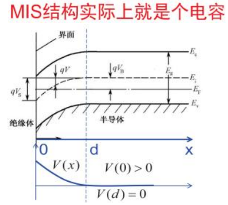

# 半导体物理 —— 图公混合

<!-- 合成判例（synthetic）：为验证 H1∩H2 冲突（公式 + 图片同时刚性）而造。
     两处引用同一张 test1.png——机械上是 2 个独立图片块，够验证行为；
     只用于锁定行为（应判 formula 并给出"图片可能被压缩"的警告），不得用于校准阈值。 -->

## 一、MIS 结构与表面势

MIS（金属-绝缘体-半导体）加偏压时能带弯曲，本质是一个电容。表面势 $V_s$ 决定表面处于积累、耗尽还是反型。

## 二、泊松方程与耗尽层

半导体内电势分布满足泊松方程：

$$
\frac{d^2\varphi}{dx^2} = -\frac{\rho(x)}{\varepsilon_s}
$$

耗尽近似下 $\rho = -qN_A$，积分两次得到耗尽层宽度：

$$
W = \sqrt{\frac{2\varepsilon_s V_s}{q N_A}}
$$

## 三、阈值电压

强反型条件是表面势等于两倍费米势 $\varphi_s = 2\phi_F$，此时阈值电压为：

$$
V_T = V_{FB} + 2\phi_F + \frac{\sqrt{2\varepsilon_s q N_A (2\phi_F)}}{C_{ox}}
$$

其中平带电压 $V_{FB}$ 由功函数差和界面电荷决定。

## 四、C-V 特性

下图对应的高频 C-V 曲线在强反型区趋于最小值——反型层电荷来不及响应高频小信号：

低频和高频曲线的分岔正是判断反型的实验依据。

## 五、电容串联关系

绝缘层电容与耗尽层电容串联：

$$
\frac{1}{C} = \frac{1}{C_{ox}} + \frac{1}{C_s}, \qquad C_{ox} = \frac{\varepsilon_{ox}}{d_{ox}}
$$

耗尽层电容随偏压变化，故总电容随栅压变化——这就是 C-V 曲线的由来。
