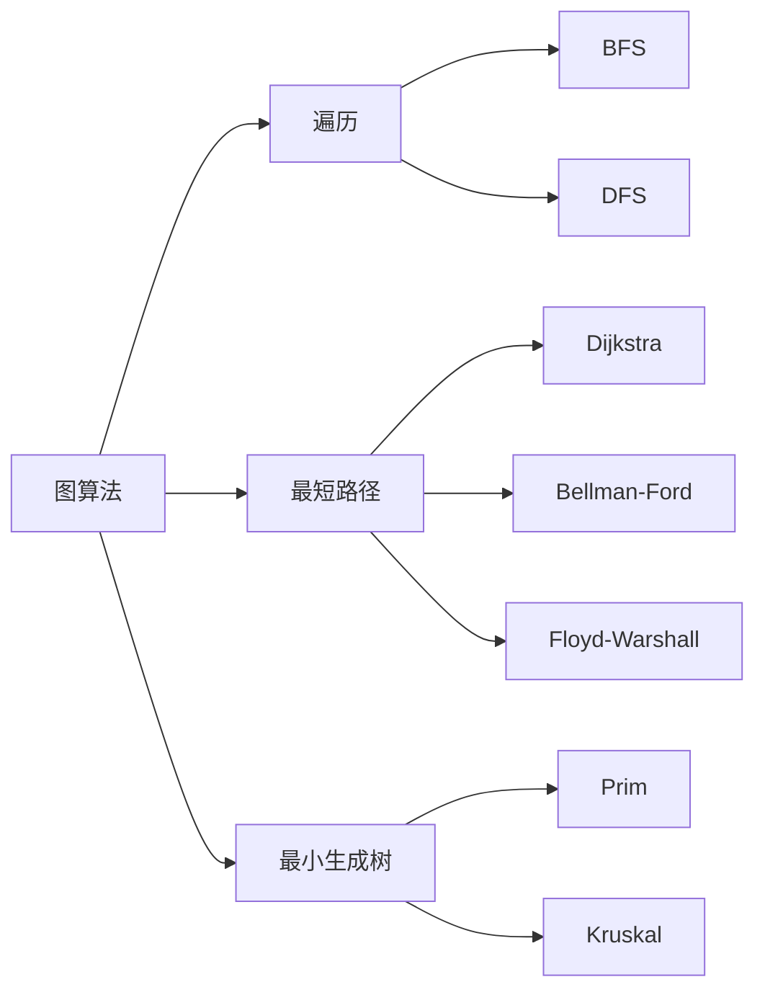

# 数据结构与算法 —— 期末考点总结

## 一、时间复杂度基础

常见复杂度从低到高排序：

$$
O(1) < O(\log n) < O(n) < O(n \log n) < O(n^2) < O(2^n) < O(n!)
$$

**主定理（Master Theorem）**：对于形如 $T(n) = aT(n/b) + f(n)$ 的递归式，设 $n^{\log_b a} = n^c$：

- 若 $f(n) = O(n^{c-\epsilon})$，则 $T(n) = \Theta(n^c)$
- 若 $f(n) = \Theta(n^c)$，则 $T(n) = \Theta(n^c \log n)$
- 若 $f(n) = \Omega(n^{c+\epsilon})$ 且满足正则条件，则 $T(n) = \Theta(f(n))$

二分搜索的复杂度推导：$T(n) = T(n/2) + O(1) \Rightarrow T(n) = O(\log n)$

## 二、排序算法对比

| 算法 | 平均时间复杂度 | 最坏时间复杂度 | 空间复杂度 | 稳定性 |
|------|--------------|--------------|-----------|--------|
| 冒泡排序 | $O(n^2)$ | $O(n^2)$ | $O(1)$ | 稳定 |
| 插入排序 | $O(n^2)$ | $O(n^2)$ | $O(1)$ | 稳定 |
| 选择排序 | $O(n^2)$ | $O(n^2)$ | $O(1)$ | 不稳定 |
| 希尔排序 | $O(n \log n)$ | $O(n^2)$ | $O(1)$ | 不稳定 |
| 归并排序 | $O(n \log n)$ | $O(n \log n)$ | $O(n)$ | 稳定 |
| 快速排序 | $O(n \log n)$ | $O(n^2)$ | $O(\log n)$ | 不稳定 |
| 堆排序 | $O(n \log n)$ | $O(n \log n)$ | $O(1)$ | 不稳定 |
| 计数排序 | $O(n+k)$ | $O(n+k)$ | $O(k)$ | 稳定 |

**快速排序核心思路**（分治 + 原地分区）：

```python
def quicksort(arr, lo, hi):
    if lo >= hi:
        return
    pivot = partition(arr, lo, hi)
    quicksort(arr, lo, pivot - 1)
    quicksort(arr, pivot + 1, hi)

def partition(arr, lo, hi):
    pivot = arr[hi]
    i = lo - 1
    for j in range(lo, hi):
        if arr[j] <= pivot:
            i += 1
            arr[i], arr[j] = arr[j], arr[i]
    arr[i + 1], arr[hi] = arr[hi], arr[i + 1]
    return i + 1
```

## 三、常见数据结构操作复杂度

| 数据结构 | 访问 | 查找 | 插入 | 删除 |
|---------|------|------|------|------|
| 数组 | $O(1)$ | $O(n)$ | $O(n)$ | $O(n)$ |
| 链表 | $O(n)$ | $O(n)$ | $O(1)$ | $O(1)$ |
| 哈希表 | — | $O(1)$* | $O(1)$* | $O(1)$* |
| 二叉搜索树（平衡） | $O(\log n)$ | $O(\log n)$ | $O(\log n)$ | $O(\log n)$ |
| 堆 | — | $O(n)$ | $O(\log n)$ | $O(\log n)$ |

> *哈希表的 $O(1)$ 是均摊/期望复杂度，最坏情况（大量哈希冲突）会退化到 $O(n)$。

## 四、二叉树遍历

```c
// 前序：根 -> 左 -> 右
void preorder(Node* root) {
    if (!root) return;
    visit(root);
    preorder(root->left);
    preorder(root->right);
}

// 中序：左 -> 根 -> 右（对 BST 中序遍历得到有序序列）
void inorder(Node* root) {
    if (!root) return;
    inorder(root->left);
    visit(root);
    inorder(root->right);
}

// 后序：左 -> 右 -> 根
void postorder(Node* root) {
    if (!root) return;
    postorder(root->left);
    postorder(root->right);
    visit(root);
}
```

递归遍历的空间复杂度取决于树高：平衡树 $O(\log n)$，退化成链表时 $O(n)$。

## 五、图算法



**Dijkstra 算法**（单源最短路径，边权非负）：时间复杂度 $O((V+E)\log V)$（用优先队列实现）。

**Floyd-Warshall**（多源最短路径）：三重循环，$O(V^3)$，状态转移方程：

$$
dist[i][j] = \min\big(dist[i][j],\ dist[i][k] + dist[k][j]\big)
$$

## 六、动态规划要点

DP 三要素：**状态定义、状态转移方程、边界条件**。

经典问题：0/1 背包 $dp[i][w] = \max(dp[i-1][w],\ dp[i-1][w-w_i] + v_i)$

最长公共子序列（LCS）：

$$
dp[i][j] = \begin{cases}
dp[i-1][j-1] + 1 & \text{if } s_1[i] = s_2[j] \\
\max(dp[i-1][j],\ dp[i][j-1]) & \text{otherwise}
\end{cases}
$$

## 七、常见易错点

- 快速排序最坏情况退化为 $O(n^2)$ 通常发生在数组已经有序、且每次选第一个/最后一个元素做 pivot 时；随机化 pivot 可以避免这种最坏情况。
- 哈希表扩容通常在装载因子（load factor）超过 0.75 左右触发，扩容本身是 $O(n)$，但均摊到每次插入是 $O(1)$。
- BFS 求最短路径只在**无权图**或**边权相同**时成立，带权图要用 Dijkstra。
- 堆是用数组实现的完全二叉树，父子节点下标关系：`parent = (i-1)/2`，`left = 2i+1`，`right = 2i+2`。
