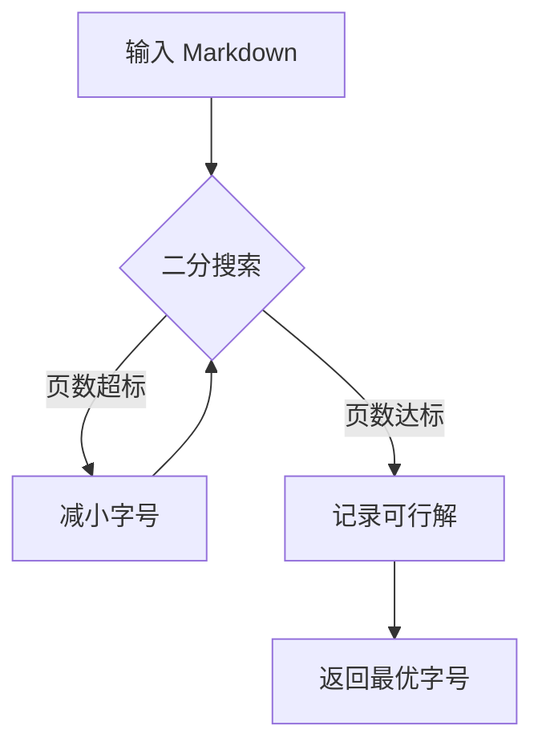
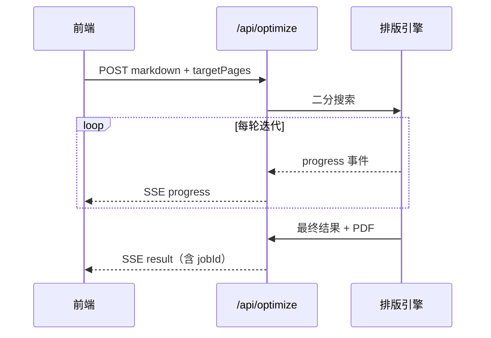

# HalfHalf 排版引擎测试样例

本文件用于人工验证排版引擎的关键能力：代码高亮、数学/物理公式、Mermaid 图表、图片缩放、长表格分页、标题不孤行。建议先以 `targetPages: 2` 跑一次二分搜索，观察字号收敛与各类原子块是否完整。

## 1. 代码块高亮（Shiki）

TypeScript 示例：

```typescript
interface SearchParams {
  markdown: string;
  targetPages: number;
}

function binarySearch(lo: number, hi: number, precision: number): number {
  while (hi - lo > precision) {
    const mid = (lo + hi) / 2;
    if (fits(mid)) {
      lo = mid;
    } else {
      hi = mid;
    }
  }
  return lo;
}
```

Python 示例（用于验证多语言高亮切换）：

```python
def fits(font_size: float, target_pages: int) -> bool:
    pages = render_pdf(font_size)
    return pages <= target_pages
```

未声明语言的代码块（应当降级为纯文本，不报错）：

```
plain text fallback block
no language specified here
```

## 2. 数学公式（KaTeX）

行内公式：质能方程 $E = mc^2$，欧拉公式 $e^{i\pi} + 1 = 0$。

独立公式块（应当被 `break-inside: avoid` 保护，不被硬切）：

$$
\int_{-\infty}^{\infty} e^{-x^2} \, dx = \sqrt{\pi}
$$

$$
\begin{aligned}
\nabla \times \vec{E} &= -\frac{\partial \vec{B}}{\partial t} \\
\nabla \times \vec{B} &= \mu_0 \vec{J} + \mu_0 \varepsilon_0 \frac{\partial \vec{E}}{\partial t}
\end{aligned}
$$

## 3. 物理公式（测试自定义宏 PHYSICS_MACROS）

矢量与微分算符：

$$
\vec{F} = m \vec{a}, \qquad \dv{v}{t} = a, \qquad \pdv{U}{x} = -F_x
$$

带单位的物理量（测试 `\unit` 宏）：

$$
c = 2.998 \times 10^8 \unit{m/s}
$$

绝对值符号（测试 `\abs` 宏）：

$$
\abs{\vec{r}} = \sqrt{x^2 + y^2 + z^2}
$$

> 如果以上任意一个公式渲染成红字或报错，说明 `PHYSICS_MACROS` 需要补充或调整。

## 4. Mermaid 图表





## 5. 图片缩放

下面这张图用于验证「图片按页面内容区宽高等比缩放，不超出单页」的规则（请替换为一张实际存在的图片路径再测试，例如仓库里没有默认测试图，可以先用任意本地图片替换 `src`）：


## 6. 长表格（跨页与表头重复）

| 序号 | 特性 | 状态 | 备注 |
|------|------|------|------|
| 1 | 自动字号搜索 | ✅ | 二分搜索 |
| 2 | 代码高亮 | ✅ | Shiki |
| 3 | 数学公式 | ✅ | KaTeX |
| 4 | 物理公式宏 | ✅ | 自定义 macros |
| 5 | Mermaid 图表 | ✅ | 预渲染一次 |
| 6 | 图片缩放 | ✅ | CSS 内容区约束 |
| 7 | 表格分页 | 🔲 | 待验证 |
| 8 | DOCX 导出 | 🔲 | 未实现 |
| 9 | AI 审核接口 | 🔲 | 未实现 |
| 10 | AI 排版建议 | 🔲 | 未实现 |

## 7. 标题不孤行测试

### 7.1 这是一个较深层级的标题

这个标题后面紧跟的段落，不应该和标题被拆到两页——如果打印结果里标题出现在页面最后一行、正文另起一页，说明 `break-before: avoid` 规则没生效。

### 7.2 另一个标题

正常段落用于填充篇幅，验证在多页情况下的整体分页效果是否符合预期。可以多次复制本节内容来人为拉长文档，测试二分搜索在长文档下的收敛速度和结果稳定性。
